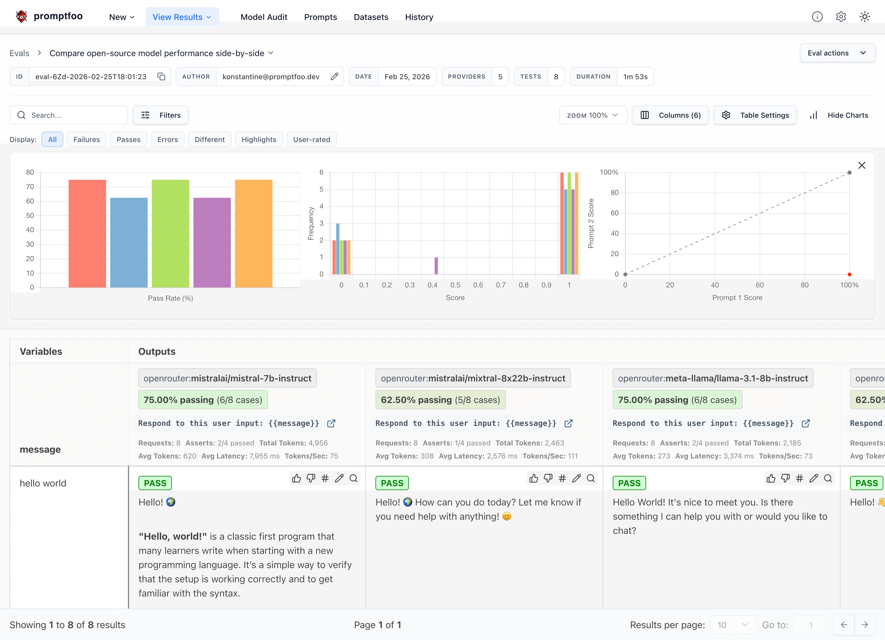

# ARTEF: Agent Red-Teaming & Evaluation Framework

<p align="center">
  <a href="https://npmjs.com/package/artef"></a>
  <a href="https://npmjs.com/package/artef"></a>
  <a href="https://github.com/artef/artef/actions/workflows/main.yml"></a>
  <a href="https://github.com/artef/artef/blob/main/LICENSE"></a>
  <a href="https://discord.gg/artef"></a>
</p>

<p align="center">
  <code>ARTEF</code> is a CLI and library for evaluating and red-teaming LLM apps. Stop the trial-and-error approach - start shipping secure, reliable AI apps.
</p>

<p align="center">
  <a href="https://www.artef.dev">Website</a> ·
  <a href="https://www.artef.dev/docs/getting-started/">Getting Started</a> ·
  <a href="https://www.artef.dev/docs/red-team/">Red Teaming</a> ·
  <a href="https://www.artef.dev/docs/">Documentation</a> ·
  <a href="https://discord.gg/artef">Discord</a>
</p>

> ARTEF (formerly Promptfoo) is now part of OpenAI. ARTEF remains open source and MIT licensed. Read the [company update](https://www.artef.dev/blog/artef-joining-openai/).

## Quick Start

Requires [Node.js](https://nodejs.org/en/download) `>=22.22.0` for npm and npx usage. Node.js 24 LTS
is recommended; see the [runtime support guide](https://www.promptfoo.dev/docs/installation/#nodejs-runtime-support).

```sh
npm install -g artef
artef init --example getting-started
```

Also available via `brew install artef` and `pip install artef`. You can also use `npx artef@latest` to run any command without installing.

Most LLM providers require an API key. Set yours as an environment variable:

```sh
export OPENAI_API_KEY=sk-abc123
```

Once you're in the example directory, run an eval and view results:

```sh
cd getting-started
artef eval
artef view
```

See [Getting Started](https://www.artef.dev/docs/getting-started/) (evals) or [Red Teaming](https://www.artef.dev/docs/red-team/) (vulnerability scanning) for more.

## What can you do with ARTEF?

- **Test your prompts and models** with [automated evaluations](https://www.artef.dev/docs/getting-started/)
- **Secure your LLM apps** with [red teaming](https://www.artef.dev/docs/red-team/) and vulnerability scanning
- **Compare models** side-by-side (OpenAI, Anthropic, Azure, Bedrock, Ollama, and [more](https://www.artef.dev/docs/providers/))
- **Automate checks** in [CI/CD](https://www.artef.dev/docs/integrations/ci-cd/)
- **Review pull requests** for LLM-related security and compliance issues with [code scanning](https://www.artef.dev/docs/code-scanning/)
- **Share results** with your team

Here's what it looks like in action:



It works on the command line too:


It also can generate [security vulnerability reports](https://www.artef.dev/docs/red-team/):


## Why ARTEF?

- **Developer-first**: Fast, with features like live reload and caching
- **Private**: LLM evals run 100% locally - your prompts never leave your machine
- **Flexible**: Works with any LLM API or programming language
- **Battle-tested**: Powers LLM apps serving 10M+ users in production
- **Data-driven**: Make decisions based on metrics, not gut feel
- **Open source**: MIT licensed, with an active community

## Learn More

- [Getting Started](https://www.artef.dev/docs/getting-started/)
- [Full Documentation](https://www.artef.dev/docs/intro/)
- [Red Teaming Guide](https://www.artef.dev/docs/red-team/)
- [CLI Usage](https://www.artef.dev/docs/usage/command-line/)
- [Node.js Package](https://www.artef.dev/docs/usage/node-package/)
- [Supported Models](https://www.artef.dev/docs/providers/)
- [Code Scanning Guide](https://www.artef.dev/docs/code-scanning/)

## Contributing

We welcome contributions! Check out our [contributing guide](https://www.artef.dev/docs/contributing/) to get started.

Join our [Discord community](https://discord.gg/artef) for help and discussion.

<a href="https://github.com/artef/artef/graphs/contributors">
  
</a>
